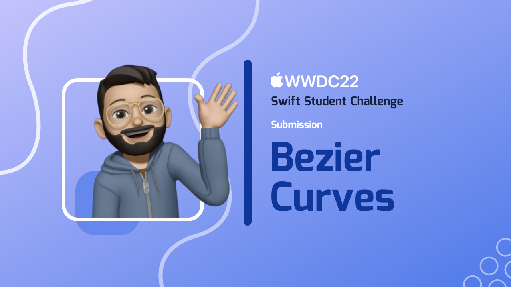

# Bezier Curves

> ## Important Note:
>- This Swift Playground app has been tested on Xcode 13.3 Simulator for iPad Pro 12.9 inch & iPad Air (5th Gen). Please use either for running the app.
>- Also, please use Portrait orientation.

## What is it about?

This is my Swift Playground app Submission for WWDC 2022 Swift Student Challenge!

This is an interactive playground to see how Bezier curves work in action!

We explore the three types of Bezier curves - Linear, Quadratic & Cubic - and how they create their respective curves using control points! There's also an exercise where we use these curves to make a fun drawing!

## Technologies used to build this project

> SwiftUI, Combine, AVKit

## Installation  💻

Download the project and run the  `.swiftpm`  file on XCode iPad Pro Simulator. 

## About Me

Hi, I'm Subhronil Saha, and I built this playground! Know more about me here:
1. LinkedIn: https://www.linkedin.com/in/subhronil-saha/
2. Github: https://github.com/subhronilsaha
3. Youtube: https://www.youtube.com/channel/UChgC6_MEWFqPH4-sdjiX4iQ

## Licenses

Music used in this project is :
Downtown Glow by Ghostrifter & Devyzed (Free for use)

